# Claim Document Verifier — Architecture Diagrams

Standard architecture and flow diagrams for the AI-powered claim verification system. These render in GitHub, GitLab, Confluence, and most Markdown viewers that support Mermaid.

---

## 1. High-Level System Architecture

```
code
```

---

## 2. Verification Pipeline — Detailed Flow (Submit Claim)

End-to-end flow from PDF upload to saved claim and UI response.

```mermaid
flowchart TB
    subgraph User["👤 User"]
        A[Upload PDF] --> B[Click Verify]
    end

    subgraph Pipeline["Verification Pipeline"]
        B --> C[1. Extract text from PDF]
        C --> D{Enough text?}
        D -->|No| E[Return error: invalid PDF]
        D -->|Yes| F[2. Load existing claims from DB]
        F --> G[3. Get embedding for new text]
        G --> H[4. Find most similar claim]
        H --> I[5. Extract key fields: new + matched]
        I --> J[6. Compute differences]
        J --> K{Compared with exists?}
        K -->|No| L[Status: accepted, duplication 0%]
        K -->|Yes| M{Key fields indicate different claim?}
        M -->|Yes ≥2 critical diffs| N[Override: status accepted, duplication 0%]
        M -->|No| O{Duplication % ≥ threshold?}
        O -->|Yes| P[7a. Agent verdict: accept / reject / flag]
        O -->|No| Q{Duplication % ≥ 50%?}
        Q -->|Yes| R[Status: flagged, reason set]
        Q -->|No| S[Status: accepted, key_differences only]
        P --> T[8. Generate claim_id, build document]
        R --> T
        S --> T
        N --> T
        L --> T
        T --> U[9. Save to MongoDB]
        U --> V[Return result to UI]
    end

    subgraph Services["Services Used"]
        C -.-> EX[extraction]
        F -.-> DB1[db.list_claims]
        G -.-> EM[embeddings]
        H -.-> SIM[similarity]
        I -.-> DIFF[diff_extractor]
        M -.-> DIFF
        P -.-> AG[agent]
        U -.-> DB2[db.save_claim, get_next_claim_id]
    end

    V --> W[Display status, duplication %, rejection reason]
```



---

## 3. Component & Data Flow

How each service fits into the pipeline and what data passes between them.

```mermaid
flowchart LR
    subgraph Input["Input"]
        PDF[PDF bytes + filename]
    end

    subgraph Pipeline["Pipeline"]
        PDF --> EX
        EX[extraction<br/>extract_text_from_pdf] --> TEXT[extracted_text]
        TEXT --> EM[embeddings<br/>get_embedding]
        EM --> EMB[embedding vector]
        TEXT --> DB_LIST[db<br/>list_claims]
        DB_LIST --> EXISTING[existing claims]
        TEXT --> SIM[similarity<br/>find_most_similar_claim]
        EXISTING --> SIM
        EMB --> SIM
        SIM --> BEST[(best match, duplication %)]
        TEXT --> KF[diff_extractor<br/>extract_key_fields]
        KF --> NEW_FIELDS[new key_fields]
        BEST --> EXIST_FIELDS[existing key_fields]
        NEW_FIELDS --> DIFF[diff_extractor<br/>compute_differences<br/>key_fields_indicate_different_claim]
        EXIST_FIELDS --> DIFF
        DIFF --> DECISION{decision}
        DECISION -->|different claim| ACC1[accepted, 0%]
        DECISION -->|≥ threshold| AG[agent<br/>get_verdict_and_reason]
        DECISION -->|< threshold| ACC2[accepted / flagged]
        AG --> VERDICT[status, key_differences, rejection_reason]
        ACC1 --> SAVE[db.save_claim]
        VERDICT --> SAVE
        ACC2 --> SAVE
        SAVE --> MONGO[(MongoDB)]
    end

    subgraph Output["Output"]
        MONGO --> RESULT[result dict → UI]
    end
```



---

## 4. Dashboard Flow

Read-only flow: list, filter, display, export.


---

## 5. Text Extraction Flow (Embedded vs OCR)

```mermaid
flowchart TB
    PDF[PDF bytes] --> PLUMBER[pdfplumber: extract embedded text]
    PLUMBER --> ENOUGH{≥ min length?}
    ENOUGH -->|Yes| RETURN1[Return text]
    ENOUGH -->|No| IMG[pdf2image: PDF → images]
    IMG --> OCR[Tesseract OCR per page]
    OCR --> JOIN[Join page texts]
    JOIN --> RETURN2[Return OCR text or fallback]
```



---

## 6. Similarity & Verdict Decision Logic

```mermaid
flowchart TB
    subgraph Similarity["Similarity"]
        NEW_TEXT[New claim text] --> NEW_EMB[get_embedding]
        EXISTING[Existing claims] --> EXIST_EMB[stored or computed embedding]
        NEW_EMB --> COS[cosine_similarity]
        EXIST_EMB --> COS
        COS --> PCT[duplication % 0–100]
        PCT --> TOP[Top-1 match]
    end

    subgraph Verdict["Verdict logic"]
        TOP --> HAS_MATCH{Has match?}
        HAS_MATCH -->|No| ACC[accepted]
        HAS_MATCH -->|Yes| DIFF_CLAIM[≥2 critical field diffs?]
        DIFF_CLAIM -->|Yes| ACC
        DIFF_CLAIM -->|No| THRESH[duplication % ≥ threshold?]
        THRESH -->|Yes| AGENT[Agent: accept / reject / flag]
        THRESH -->|No| FIFTY[duplication % ≥ 50%?]
        FIFTY -->|Yes| FLAG[flagged]
        FIFTY -->|No| ACC
        AGENT --> FINAL[Final status]
        FLAG --> FINAL
        ACC --> FINAL
    end
```



---

## 7. Mermaid Source (Copy-Paste)

If your viewer does not render the diagrams above, you can copy the Mermaid blocks into [Mermaid Live Editor](https://mermaid.live) or any Mermaid-supported tool to view or export as PNG/SVG.

### Verification pipeline (flowchart)

```mermaid
flowchart TB
    A[Upload PDF] --> B[Extract text]
    B --> C{Enough text?}
    C -->|No| ERR[Error]
    C -->|Yes| D[Load existing claims]
    D --> E[Embed new text]
    E --> F[Find most similar]
    F --> G[Extract key fields + diff]
    G --> H{Different claim?}
    H -->|Yes| I[Accepted, 0%]
    H -->|No| J{Duplication ≥ threshold?}
    J -->|Yes| K[Agent verdict]
    J -->|No| L[Accepted or Flagged]
    K --> M[Save to MongoDB]
    L --> M
    I --> M
    M --> N[Return to UI]
```



---

*Diagrams align with `ARCHITECTURE.md` and the implementation in `services/pipeline.py`, `services/diff_extractor.py`, and related modules.*
